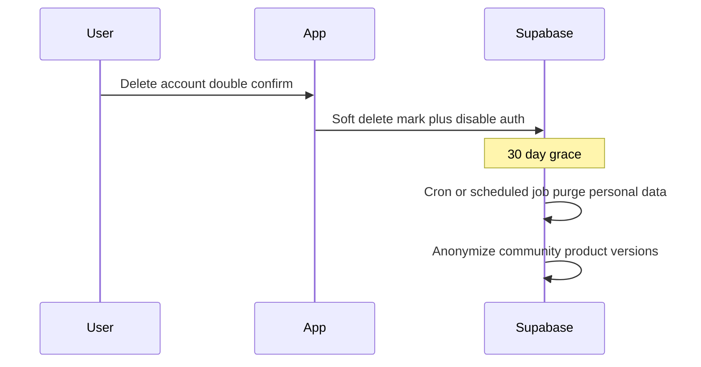

# Plan: v0.3.0 — Settings identity, dates + GDPR

| Field | Value |
|---|---|
| Status | Planned |
| Roadmap | [`ROADMAP_MINOR.md`](../ROADMAP_MINOR.md) → **v0.3.0** |
| Depends on | Username RPCs; auth; profiles; diary; Expo config version (already in Settings) |
| Related | Supersedes [`v1.0.3-settings-identity.md`](v1.0.3-settings-identity.md) + [`v1.0.3-gdpr-account.md`](v1.0.3-gdpr-account.md) |
| Later | Metric / imperial units preference (not this patch; see ROADMAP deferred / NON_GOALS) |

## Problem

Users cannot fix username, password, or email in Settings. DOB is awkward to type; jumping many diary/report days with only ‹ › is slow. Store review and GDPR need in-app **download my data** and **delete account**.

## Goal

One Settings ship: identity edits, shared native date UX + date format preference, and a privacy section for export + soft-delete with 30-day grace.

## Locked decisions

| Topic | Choice |
|---|---|
| Identity | Username + password + email all changeable in Settings |
| Date format | Profile setting; **default DD-MM-YYYY**; also offer **YYYY-MM-DD** and **MM-DD-YYYY** |
| Diary / reports jump | Diary **and** reports; native picker; any past date + today; no future; week mode → week containing picked day |
| Account delete | Soft delete / lockout immediately + **30-day grace**, then purge |
| Export | Full **JSON** + **diary CSV** (in-app share/save, not email-only) |
| Export contents | Profile + diary + goals / body metrics + feedback they sent |
| Docs | This single plan file |

## Settings identity

- Edit **username** (existing uniqueness + format rules; clear collision errors).
- Change **password** while signed in (`updateUser`; re-auth / current password if Supabase requires it).
- Change **email** with Supabase confirm-to-new-address; reuse auth deep-link patterns where needed; nl/en confirm copy.
- App version already shown (Expo config via `expo-constants`).

## Dates

- Shared native picker (`@react-native-community/datetimepicker` or Expo-compatible wrapper) for DOB (onboarding + Settings) and diary/reports jump.
- Tap date label → picker → set anchor; empty days OK; no auto-purge of old diary rows.
- **Date format** preference on `profiles`; apply everywhere dates are shown.

**Storage note:** diary has no retention limit today. Allowing far-past jumps does not by itself grow storage; logging does. Retention policy (if ever) is a separate decision.

## GDPR privacy (Settings)

### Download my data

- Produce downloadable **JSON** covering: profile, diary entries, goals/body metrics, feedback rows they submitted.
- Produce **CSV** of diary rows (spreadsheet-friendly).
- In-app save/share on device (no “email us for your data” as the only path).

### Delete account

- Double confirm; irreversible messaging (grace = cancel window only if we add “restore” later; v1 = no restore UI unless cheap).
- Immediate: user cannot sign in.
- After 30 days: purge auth user + personal tables; anonymize community versions per DATA_MODEL / LEGAL (products may remain without personal identity).
- Implement purge via Supabase scheduled edge function / cron (document job name in migration or SETUP when coding).

## Out of scope

- Metric / imperial / lb / oz / kJ display toggles (roadmap deferred; date format is the preference pattern for now)
- Custom in-app month-grid calendar
- Auto-archival of old diary for storage cost
- Broader password-reset rework beyond what email-change needs
- Admin bulk GDPR tools

## Acceptance criteria

- [ ] Username / password / email changeable with clear nl/en errors
- [ ] DOB picker works on Android (Expo Go)
- [ ] Diary: tap date → that day; not future
- [ ] Reports day: tap → that day; reports week: tap → week containing that day
- [ ] Date format setting persists; default DD-MM-YYYY; other formats offered work in UI
- [ ] Version string matches Expo config
- [ ] Export JSON + diary CSV include agreed datasets; no support email required
- [ ] Delete: immediate lockout; purge after 30 days; cannot sign in after delete
- [ ] Store account-deletion guideline noted in SETUP or LEGAL briefly
- [ ] nl/en via i18n

## Test plan

- [ ] Change username; sign out; sign in with new username
- [ ] Change password; sign in with new password
- [ ] Change email; confirm via link; sign in with new email
- [ ] Set DOB via picker; reopen Settings
- [ ] Diary jump 30+ days back; empty day OK; cannot pick tomorrow
- [ ] Reports week: pick Wednesday → range includes that Wednesday
- [ ] Toggle date formats; labels update
- [ ] Export opens/shares JSON + CSV with expected sections
- [ ] Delete account; sign-in fails; after grace simulation data purged / anonymized

## Implementation notes (when coding)

- Shared date hook/component used by Settings DOB, diary, reports.
- Reports week: set `anchor` to picked date; existing Monday `weekStart` logic.
- Soft-delete column(s) on profile or dedicated `deletion_requested_at`; cron selects due rows.
- Export: server RPC or edge function preferred so RLS cannot be bypassed client-side inconsistently.
